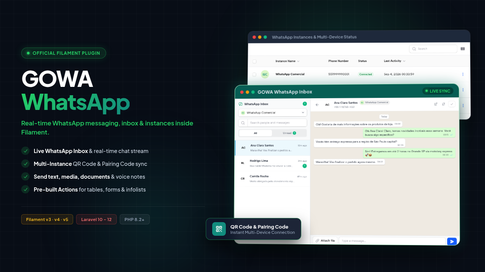
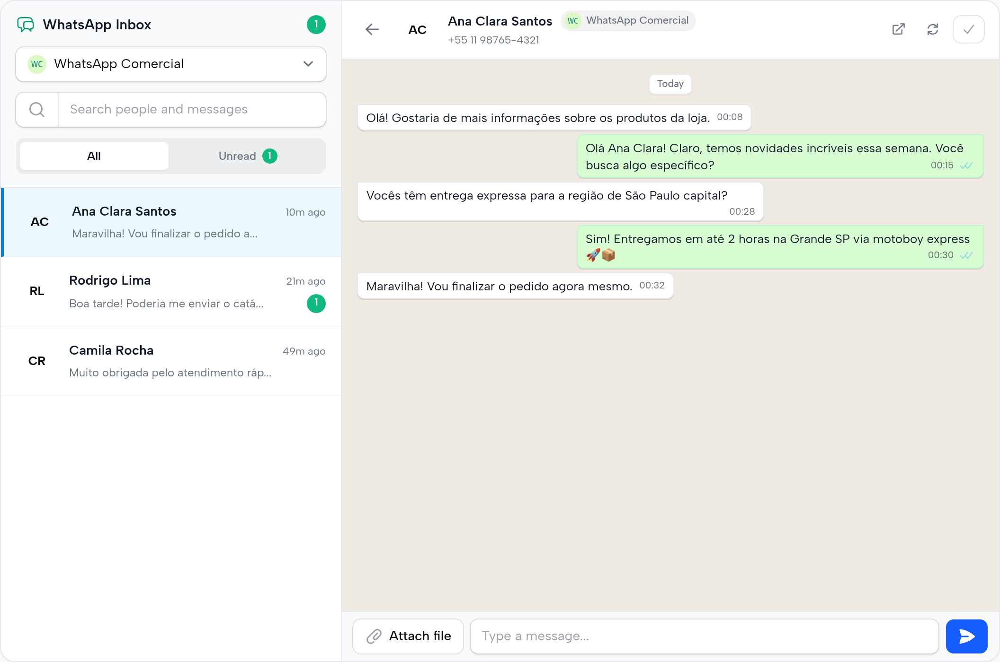
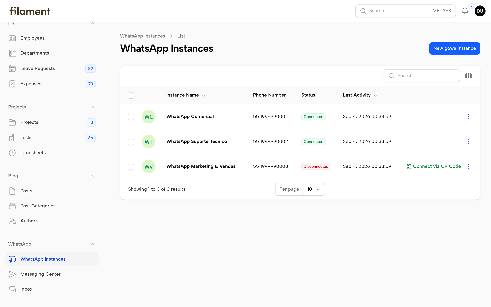
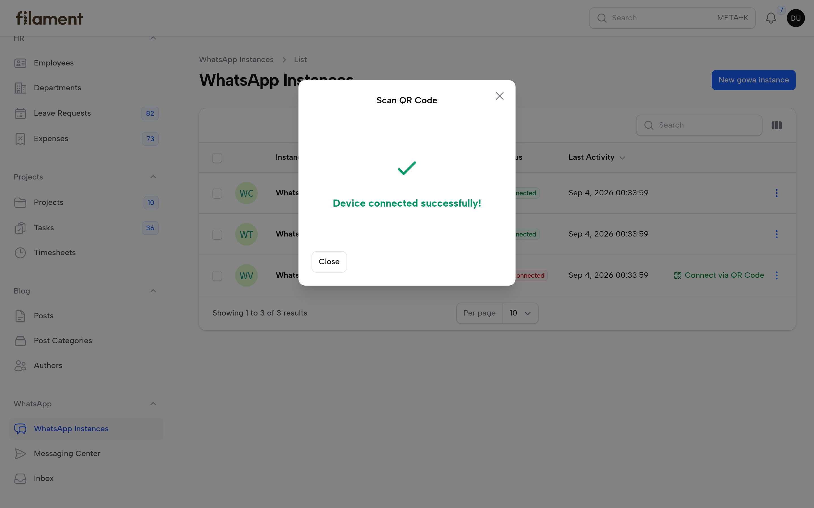
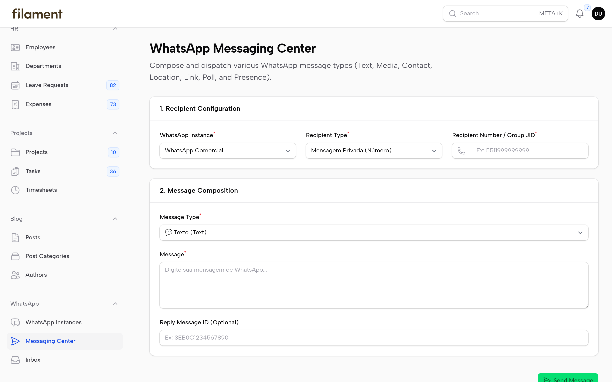

<div align="center">
  

  # gowa-php/filament

  **Filament v5 / v4 / v3 plugin for integrating GOWA WhatsApp instances into Laravel Filament applications**

  [](https://packagist.org/packages/gowa-php/filament)
  [](https://packagist.org/packages/gowa-php/filament)
  [](LICENSE)
  [](https://php.net)
  [](https://laravel.com)
  [](https://filamentphp.com)

</div>

---

> 🇧🇷 Para ler a documentação em Português, acesse [README.pt.md](README.pt.md).

---

## ⚡ Acknowledgments & Ecosystem Dependencies

This package is Phase 3 of the GOWA PHP ecosystem and interacts with the open-source Go backend ecosystem:

- **[whatsmeow](https://go.mau.fi/whatsmeow)** — The underlying Go library created by [Tulir Asokan](https://github.com/tulir) that reverse-engineers the WhatsApp Web Multi-Device WebSocket protocol and Signal encryption.
- **[go-whatsapp-web-multidevice (GOWA)](https://github.com/aldinokemal/go-whatsapp-web-multidevice)** — The lightweight REST API wrapper created by [Aldino Kemal](https://github.com/aldinokemal) exposing `whatsmeow` over HTTP and Webhooks.
- **[gowa-php/sdk](https://packagist.org/packages/gowa-php/sdk)** — Pure PHP SDK for GOWA REST API and Webhook parsing.
- **[gowa-php/laravel](https://packagist.org/packages/gowa-php/laravel)** — Laravel integration providing Facades, Notification Channels, Webhook routes, and Eloquent models.

---

## 📦 Prerequisites & Requirements

* **Running GOWA Server**: An active instance of [go-whatsapp-web-multidevice (GOWA)](https://github.com/aldinokemal/go-whatsapp-web-multidevice). `GOWA_BASE_URL` is **required** in your `.env`.
* **PHP**: `>= 8.2`
* **Laravel**: `^10.0 | ^11.0 | ^12.0`
* **Filament**: `^3.0 | ^4.0 | ^5.0`
* **GOWA Packages**: `gowa-php/sdk ^1.0`, `gowa-php/laravel ^1.1`

---

## 🔧 Installation

Install the package via Composer:

```bash
composer require gowa-php/filament
```

Publish the configuration file (optional):

```bash
php artisan vendor:publish --tag="gowa-filament-config"
```

---

## ⚙️ Environment Configuration (`.env`)

Add the GOWA server connection credentials to your `.env` file:

```env
# GOWA WhatsApp Server Connection
GOWA_BASE_URL=https://gowa.yourcompany.com
GOWA_USERNAME=admin
GOWA_PASSWORD=secret
GOWA_TIMEOUT=15

# Webhook Configuration (Optional)
GOWA_WEBHOOK_SECRET=your_hmac_secret
GOWA_WEBHOOK_PATH=webhooks/gowa
```

---

## ⚡ Quick Start

Add `GowaPlugin` to your Filament Panel Provider (e.g., `AdminPanelProvider.php`):

```php
use Gowa\Filament\GowaPlugin;

public function panel(Panel $panel): Panel
{
    return $panel
        ->default()
        ->id('admin')
        ->path('admin')
        ->plugins([
            GowaPlugin::make(),
        ]);
}
```

---

## ✨ Key Features

- **💬 Real-Time WhatsApp Inbox & Chat (`GowaConversationsPage`)**: Full two-way live messaging inbox inside Filament with contact search, unread filter, message status checkmarks (sent, delivered, read), media and document attachment modals, and instant multi-instance switcher.
- **📱 GOWA Instance Resource (`GowaInstanceResource`)**: View, create, edit, and manage connected WhatsApp instances with slide-over modals and native Filament Infolists.
- **🔗 Webhook Synchronization & Secret Generator**: Synchronize webhook URLs and HMAC secrets directly with the GOWA Go server without disconnecting. Includes a 32-character random secret generator action.
- **📷 Real-Time QR Code Modal**: Scan QR codes directly in Filament with automatic polling (`wire:poll.3s`).
- **🔢 8-Digit Pairing Code Modal**: Link WhatsApp using a phone number with copy-to-clipboard pairing code.
- **🧪 Messaging Test Sandbox (`GowaMessagingPage`)**: Interactive playground supporting all 11 GOWA message formats:
  - 💬 **Text**: Plain text messages with reply targeting.
  - 🖼️ **Image**: Image upload with native Filament Image Editor (crop, rotate, flip).
  - 🎥 **Video**: Video file uploads (`.mp4`, `.avi`, `.mov`).
  - 📄 **Document / File**: Upload PDFs, CSVs, DOCX, XLSX, ZIP archives up to 50MB.
  - 🎙️ **Audio / Voice Note**: Send audio files or simulate voice notes (PTT).
  - 🏷️ **Sticker**: Send WebP/PNG stickers.
  - 👤 **Contact Card**: Share WhatsApp contact cards.
  - 📍 **Location**: Share GPS coordinates with location names and addresses.
  - 🔗 **Link Preview**: Send links with automated open-graph previews.
  - 📊 **Poll**: Interactive multi-option voting polls.
  - 📡 **Presence Status**: Update typing (`composing`) or recording (`recording`) status.
- **⚡ Fluent WhatsApp Actions & Facade**: Send messages intuitively using either the Laravel Fluent Facade (`Gowa::to()->from()->text()->send()`) or the dedicated Filament Action (`SendGowaAction::make()->to()->from()->text()->direct()`). Supports both direct one-click execution and interactive modal review.
- **✉️ Specialized Resource Actions**:
  - `SendGowaAction`: Unified fluent action supporting text, images, videos, audio, voice notes, documents, polls, contacts, locations, and custom fluent closures.
  - `SendGowaMessageAction`: Quick text messages with dynamic templates and modal support.
  - `SendGowaDocumentAction`: Send PDFs, invoices, contracts, or spreadsheets via file path or URL.
  - `SendGowaMediaAction`: Send images, videos, or audio with custom captions.
  - `UpdateWebhookAction`: Instantly synchronize webhook URL and HMAC secret settings with GOWA backend.
- **📊 Real-time Status Widget (`GowaDeviceStatusWidget`)**: Dashboard card displaying Connected, Connecting, and Offline instances.
- **🌐 Multilingual Support**: Built-in English (`en`) and Portuguese (`pt_BR`) translations.

---

## 📸 Screenshots

### WhatsApp Live Inbox & Chat

<p align="center">
  
</p>

### WhatsApp Instances Management

<p align="center">
  
</p>

### QR Code Connection Modal

<p align="center">
  
</p>

### Messaging Center Sandbox

<p align="center">
  
</p>

---

## 💡 Filament Actions & Fluent API Usage Examples

### 1. Fluent Action (`SendGowaAction`)

`SendGowaAction` offers a chainable, fluent API directly on your Filament tables or forms:

#### Direct Send (No Modal):

```php
use Gowa\Filament\Actions\SendGowaAction;

SendGowaAction::make()
    ->to(fn ($record) => $record->phone_number)
    ->text(fn ($record) => "Hello {$record->name}, your order #{$record->id} has been confirmed!")
    ->direct(); // Dispatches immediately upon clicking
```

#### Modal Confirmation & Prefilled Form:

```php
use Gowa\Filament\Actions\SendGowaAction;

SendGowaAction::make('contactCustomer')
    ->label('WhatsApp Customer')
    ->to(fn ($record) => $record->phone)
    ->text(fn ($record) => "Hi {$record->first_name}, regarding your recent inquiry...");
    // Opens a sleek Filament modal allowing the operator to review or edit before sending
```

#### Sending Invoices, Documents & Media Fluently:

```php
// Send PDF Invoice
SendGowaAction::make('sendInvoice')
    ->to(fn ($record) => $record->customer_phone)
    ->document(fn ($record) => $record->pdf_url, filename: 'invoice.pdf')
    ->direct();

// Send Image / Photo
SendGowaAction::make('sendPhoto')
    ->to(fn ($record) => $record->phone)
    ->image(fn ($record) => $record->receipt_url, caption: 'Payment receipt confirmation')
    ->direct();
```

#### Advanced Custom Fluent Callback (`->fluent()`):

```php
use Gowa\Filament\Actions\SendGowaAction;
use Gowa\Laravel\PendingMessage;

SendGowaAction::make('sendFeedbackPoll')
    ->fluent(fn (PendingMessage $msg, $record) => $msg
        ->to($record->phone)
        ->from($record->device_id)
        ->poll('How satisfied are you with our service?', ['Very Satisfied', 'Satisfied', 'Neutral', 'Unsatisfied'])
    )
    ->direct();
```

### 2. Fluent Laravel Facade Anywhere in Filament

You can also use `gowa-php/laravel`'s fluent facade directly in custom actions, form lifecycles, or bulk actions:

```php
use Gowa\Laravel\Facades\Gowa;

// Send text fluently
Gowa::to($record->phone)
    ->from($record->device_id)
    ->text("Your order status has been updated to {$record->status}.")
    ->send();

// Send document fluently
Gowa::to($record->phone)
    ->document(Storage::path('invoices/inv-1001.pdf'))
    ->send();
```

### 3. Specialized Modal Actions

#### Send Quick Text Message (`SendGowaMessageAction`)

```php
use Gowa\Filament\Actions\SendGowaMessageAction;

SendGowaMessageAction::make()
    ->to(fn ($record) => $record->phone_number)
    ->text(fn ($record) => "Hello {$record->name}, your order #{$record->id} has been shipped!");
```

#### Send PDF Document or Invoice (`SendGowaDocumentAction`)

```php
use Gowa\Filament\Actions\SendGowaDocumentAction;

SendGowaDocumentAction::make('sendInvoice')
    ->label('Send Invoice PDF')
    ->to(fn ($record) => $record->customer_phone)
    ->document(fn ($record) => $record->pdf_download_url, filename: fn ($record) => "invoice-{$record->code}.pdf");
```

#### Send Media / Photos / Videos (`SendGowaMediaAction`)

```php
use Gowa\Filament\Actions\SendGowaMediaAction;
use Gowa\Sdk\Dto\MediaType;

SendGowaMediaAction::make('sendReceipt')
    ->label('Send Payment Receipt')
    ->type(MediaType::Image)
    ->to(fn ($record) => $record->client_phone)
    ->mediaFrom('receipt_path')
    ->caption('Here is your payment confirmation receipt.');
```

---

## 🧪 Testing

Run Pest PHP tests:

```bash
composer test
```

---

## ⚠️ Disclaimer & Terms of Use

This software is an open-source library created for **educational, research, and testing laboratory purposes**.

- **Third-Party Terms of Service**: Users of this library are solely responsible for complying with WhatsApp's Terms of Service, Meta's Platform Policies, and the terms of any third-party services utilized.
- **Automated Messaging & Policy Compliance**: Automated or unauthorized messaging may violate platform terms. Users must ensure strict compliance with applicable privacy laws (e.g., GDPR, LGPD), user consent requirements, and platform guidelines.
- **No Warranty & Liability**: This software is provided "as is", without warranty of any kind, express or implied. The authors and contributors assume no liability for any account bans, data loss, service interruptions, or misuse of this library.

---

## 📄 License

The MIT License (MIT). Please see [LICENSE](LICENSE) for more information.
